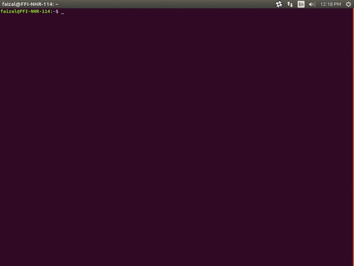
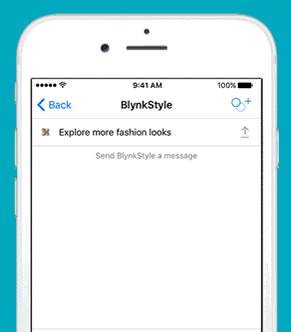
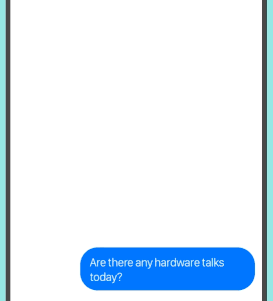

<h1 align="center">Barbie with Brain Chatbot</h1>

# ChatBotAI
Python chatbot AI that helps in creating a python based chatbot with
minimal coding. This provides both bots AI and chat handler and also
allows easy integration of REST API's and python function calls which
makes it unique and more powerful in functionality. This AI provides
numerous features like learn, memory, conditional switch, topic-based
conversation handling, etc.


<p align="center">
  
</p>

<p align="center">
  
</p>

<p align="center">
  
</p>

## Installation

Install from PyPI:
```sh
pip install chatbotAI
```

install from github:
```sh
git clone https://github.com/deepanshubajaj/Barbie-with-Brains-Chatbot.git
cd Chatbot
python setup.py install
```

## Demo
```shell
>>> from chatbot import demo
>>> demo()
Hi, how are you?
> i'm fine
Nice to know that you are fine  
> quit
Thank you for talking with me.
>>> 
```

## Sample Code (with wikipedia search API integration)

```python
from chatbot import Chat, register_call
import wikipedia


@register_call("whoIs")
def who_is(session, query):
    try:
        return wikipedia.summary(query)
    except Exception:
        for new_query in wikipedia.search(query):
            try:
                return wikipedia.summary(new_query)
            except Exception:
                pass
    return "I don't know about "+query

first_question="Hi, how are you?"
Chat("examples/Example.template").converse(first_question)
```

## List of feature supported in bot template
1. [Memory](#memory)
2. [Get matched group](#get-matched-group)
3. [Recursion](#recursion)
4. [Condition](#condition)
5. [Change Topic](#change-topic)
6. [Interact with python function](#interact-with-python-function)
7. [REST API integration](#rest-api-integration)
8. [Topic based group](#topic-based-group)
9. [Learn](#learn)
10. [To upper case](#to-upper-case)
11. [To lower case](#to-lower-case)
12. [Capitalize](#capitalize)
13. [Previous](#previous)

---

## Memory

#### Set Memory
```
{ variable : value }
```
In think mode
```
{! variable : value }
```

#### Get Memory
```
{ variable }
```

## Get matched group
for grouping in regex refer [Python regular expression docs](https://docs.python.org/3/howto/regex.html#non-capturing-and-named-groups)
#### Get N<sup>th</sup> matched group of client pattern
```
%N
```
Example to get first matched
```
%1
```
#### Get matching named group of client pattern
```
%Client_pattern_group_name
```
Example to get matching named group `person`
```
%person
```

#### Get N<sup>th</sup> matched group of bots message pattern
```
%!N
```
Example to get first matched
```
%!1
```

#### Get matching named group of bots message pattern
```
%!Bot_pattern_group_name
```
Example to get matching named group `region`
```
%!region
```

## Recursion
Get response as if client said this new statement
```

```
It will do a pattern match for statement

## Condition
``` 
 do this first  do this next  do otherwise 
```

## Change Topic
```

```

## Interact with python function
##### In python 
```python
@register_call("functionName")
def function_name(session, query):
    return "response string"
```
##### In template 
```

```

## REST API integration
 
### In API.json file
 ```
{
    "APIName":{
        "auth" : {
            "url":"https://your_rest_api_url/login.json",
            "method":"POST",
            "data":{
                "user":"Your_Username",
                "password":"Your_Password"
            }
        },
        "MethodName" : {
            "url":"https://your_rest_api_url/GET_method_Example.json",
            "method":"GET",
            "params":{
                "key1":"value1",
                "key2":"value2",
                ...
            },
            "value_getter":[order in which data has to be picked from json response]
        },
        "MethodName1" : {
            "url":"https://your_rest_api_url/GET_method_Example.json",
            "method":"POST",
            "data":{
                "key1":"value1",
                "key2":"value2",
                ...
            },
            "value_getter":[order in which data has to be picked from json response]
        },
        "MethodName2" : {
            ...
        },
        ...
    },
    "APIName2":{
        ...
    },
    ...
}
```
*If authentication is required only then `auth` method is needed.The `data` and `params` defined in pi.json file acts as defult values and all key value pair defined in template file overrides the default value.`value_getter` consistes of list of keys in order using which info from json will be collected.*

### In Template file
```
[ APIName:MethodName,Key1:value1 (,Key*:value*) ]
```
you can have any number of key value pair and all key value pair will override data or params depending on `method`, if `method` is `POST` then it overrides data and if method is `GET` then it overrides `params`.

## Topic based group 
```

  
      client says 
      response text
  
  ...

```

## Learn
```

  
    
        client says 
        response text
    
    ...
  
  ...

```

## To upper case
```

```

## To lower case
```

```

## Capitalize
```

```

## Previous
```

    client's statement pattern
    previous bot's statement pattern
    response string

```


<p align="center">
  
</p>

---

## 🤝 Contributing

Thank you for your interest in contributing to this project!  
I welcome contributions from the community.

- You are free to use, modify, and redistribute this code under the terms of the MIT License.
- If you'd like to contribute, please **open an issue** or **submit a pull request**.
- All contributions will be reviewed and approved by the author — **Deepanshu Bajaj**.

---

## 📃 License

This project is licensed under the [MIT License](./LICENSE).  
You are free to use this project for personal, educational, or commercial purposes — just make sure to provide proper attribution.

> **Clarification:** Commercial use includes, but is not limited to, use in products,  
> services, or activities intended to generate revenue, directly or indirectly.
